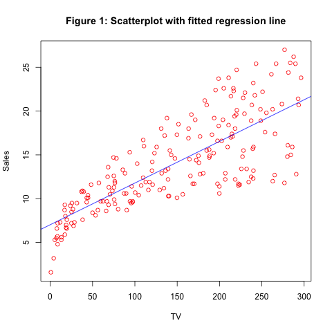

## Abstract
This report aims to reproduce the main results displayed in **section 3.1: Simple Linear Regression** of the book **_An Introduction to Statistical Learning_** and perform simple linear regression analysis on the data set `Advertising`.

## Introduction
The overall goal is to provide advice on how to improve sales of the particular product. More specifically, the idea is to determine whether there is an association between advertising and sales, and if so, develop an accurate model that can be used to predict sales on the basis of the three media budgets.


## Data
The data set `Advertising` is provided by the author of the book. This data set has four variables. It consists of the Sales (in thousands of units) of a particular product in 200 different markets, along with advertising budgets (in thousands of dollars) for the product in each of those markets for three different media: TV, Radio, and Newspaper.

## Methology
In this paper, we mainly consider the relatinoship between Sales and one media from the data set, **TV**. In order to explore this relationship, we use a simple linear model and regress `sales` onto `TV` by fitting the model:

$$Sales = \beta_{0} + \beta_{1} TV$$

Mathematically, $\beta_0$ represents the intercept and $\beta_1$ represents the slope terms in the linear model.
With this linear model, we estimate the coefficients by minimizing the least squares criterion, which is minimizing the sum of squared errors.

## Results
With the least square estimators, we compute the regression coefficients:

```{r}
# All the numbers couuld be retrieved from regression.RData
load("../data/regression.RData")
inter_est = lm_ad[1][1]
inter_se = lm_ad[1][2]
```

Table 1: Information about Regression Coefficients
------------------------------------------------------------
Coefficients| Estimate | Std. Error | t-statistic | Pr value
------------|----------|------------|-------------|---------
Intercept   | 7.0325   | 0.4578     | 15.36       | <0.00
TV          | 0.0475   | 0.0027     | 17.67       | <0.00

More information about the least squares model is given in the table below:

Table 2: Regression Quality Indices
-------------------------------
Quantity               | Value
-----------------------|-------
Residual Standard Error| 3.259
R-squared              | 0.612
F-statistic            | 312.14

Here is the scatterplot


Figure 1: Scatter Plot with fitted Regression Line


## Conclusions
From the reproduced graph we can see the same results as produced in the book, namely "a linear fit captures the essence of the relationship, although it is somewhat deficient in the left of the plot." This project helps us to fully understand the simple linear regression model, its mathematical interpretation, and all the data retrieved from the R fitted linear model.


